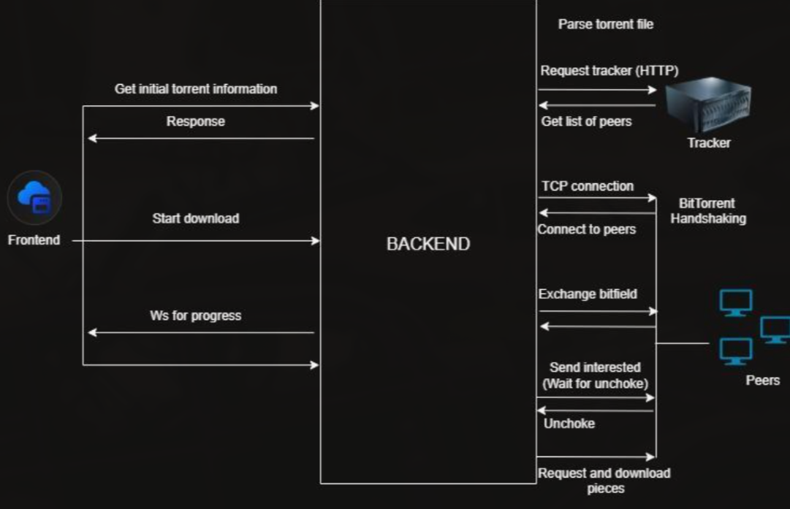

# Torrex

> A high-performance BitTorrent client library built in Rust from scratch.

**Demo: [Link:](https://youtu.be/sFCeABew5mo)**

## Features

- **Torrent File Parsing:** Decode `.torrent` files using built-in Bencode parsing.
- **Magnet Link Support:** Resolve magnet links via Extended Metadata Exchange.
- **HTTP API:** RESTful API built with `actix-web` for managing downloads (start, pause, resume, stop).
- **Real-time Progress:** WebSocket integration for streaming live download progress to clients.
- **Peer Discovery:** Fetch peer IPs from any standard HTTP tracker (it is **not** limited to CodeCrafters; it fully supports all standard public and private HTTP trackers). Note that UDP trackers are not supported yet.
- **Swarm Management:** Connect to multiple peers concurrently to download pieces and verify hashes.

## Getting Started

### Prerequisites

- [Rust toolchain](https://www.rust-lang.org/tools/install) (cargo, rustc)

### Installation

1. Clone the repository:

   ```bash
   git clone https://github.com/your-username/torrex.git
   cd torrex
   ```

2. Build the project:

   ```bash
   cargo build --release
   ```

### Running the API Server

Start the HTTP API server. By default, it runs on port `7878`:

```bash
cargo run -p torrex-api
```

The server will now be accessible at `http://127.0.0.1:7878`.

### Quick Test (Recommended Test Downloads)

> **Why these links?** Public torrent seeders often throttle or ban new peers. The [CodeCrafters](https://codecrafters.io) test tracker (`bittorrent-test-tracker.codecrafters.io`) is purpose-built for BitTorrent client testing — it responds reliably and never chokes connections, making it the best starting point for verifying Torrex works correctly.

The `sample.torrent` file is included in the repo under `torrex-lib/` and points to the same CodeCrafters tracker:

```bash
# Load the bundled sample.torrent (downloads sample.txt, ~90 KB)
GET http://127.0.0.1:7878/torrex/api/v1/initial_info_metafile?filepath="torrex-lib/sample.torrent"
```

Or use one of these CodeCrafters magnet links directly:

| File          | Magnet Link                                                                                                                                      |
| ------------- | ------------------------------------------------------------------------------------------------------------------------------------------------ |
| `magnet1.gif` | `magnet:?xt=urn:btih:ad42ce8109f54c99613ce38f9b4d87e70f24a165&dn=magnet1.gif&tr=http%3A%2F%2Fbittorrent-test-tracker.codecrafters.io%2Fannounce` |
| `magnet2.gif` | `magnet:?xt=urn:btih:3f994a835e090238873498636b98a3e78d1c34ca&dn=magnet2.gif&tr=http%3A%2F%2Fbittorrent-test-tracker.codecrafters.io%2Fannounce` |
| `magnet3.gif` | `magnet:?xt=urn:btih:c5fb9894bdaba464811b088d806bdd611ba490af&dn=magnet3.gif&tr=http%3A%2F%2Fbittorrent-test-tracker.codecrafters.io%2Fannounce` |

Example using `magnet1.gif`:

```bash
# 1. Load the magnet link
GET http://127.0.0.1:7878/torrex/api/v1/initial_info_magnet?url=magnet:?xt=urn:btih:ad42ce8109f54c99613ce38f9b4d87e70f24a165&dn=magnet1.gif&tr=http%3A%2F%2Fbittorrent-test-tracker.codecrafters.io%2Fannounce

# 2. Start the download (use uuid from step 1's response)
POST http://127.0.0.1:7878/torrex/api/v1/start_download
Content-Type: application/json
{ "uuid": "<uuid-from-step-1>" }

# 3. Watch progress over WebSocket
ws://127.0.0.1:7878/torrex/api/v1/ws/download/<uuid-from-step-1>
```

## API Reference

The API is exposed under the `/torrex/api/v1` path prefix.

### 1. Check API Status

Check if the API server is up and running.

- **Endpoint:** `GET /`
- **Response:**

  ```json
  { "success": "true", "message": "Torrex API is running" }
  ```

### 2. Load `.torrent` File

Parse and load a local `.torrent` file to prepare for downloading.

- **Endpoint:** `GET /initial_info_metafile`
- **Query Parameters:**
  - `filepath`: Path to the `.torrent` file.
- **Example:**
  `GET /torrex/api/v1/initial_info_metafile?filepath="sample.torrent"`
- **Response:**

  ```json
  {
    "success": "true",
    "uuid": "<download-uuid>",
    "name": "filename.iso",
    "length": 104857600
  }
  ```

### 3. Load Magnet Link

Parse and resolve a magnet link to prepare for downloading.

- **Endpoint:** `GET /initial_info_magnet`
- **Query Parameters:**
  - `url`: The full magnet URL.
- **Example:**
  `GET /torrex/api/v1/initial_info_magnet?url=magnet:?xt=urn:btih:...`

### 4. Start Download

Initiate the download process for a previously loaded torrent or magnet link.

- **Endpoint:** `POST /start_download`
- **Content-Type:** `application/json`
- **Body:**

  ```json
  {
    "uuid": "<download-uuid>",
    "destination": "/optional/custom/save/path"
  }
  ```

  _(If `destination` is omitted, the downloaded file will be saved to the system's temporary directory)._

### 5. Stream Download Progress

Connect via WebSocket to stream real-time download progress events.

- **Endpoint:** `WS /ws/download/{uuid}`
- **Example:**
  `ws://127.0.0.1:7878/torrex/api/v1/ws/download/<download-uuid>`

### 6. Pause Download

Pause an active download manager.

- **Endpoint:** `GET /pause`
- **Query Parameters:**
  - `uuid`: The UUID of the download.
- **Example:**
  `GET /torrex/api/v1/pause?uuid=<download-uuid>`

### 7. Resume Download

Resume a paused download.

- **Endpoint:** `GET /resume`
- **Query Parameters:**
  - `uuid`: The UUID of the download.
- **Example:**
  `GET /torrex/api/v1/resume?uuid=<download-uuid>`

### 8. Stop Download

Stop a download entirely and close connections.

- **Endpoint:** `GET /stop`
- **Query Parameters:**
  - `uuid`: The UUID of the download.
- **Example:**
  `GET /torrex/api/v1/stop?uuid=<download-uuid>`

## System Architecture Flow Diagram

The following diagram illustrates the high-level architecture and data flow between the client, Torrex API, and the Torrex library.



## Todo

- [ ] Extend support for various .torrent file metainfo.
- [ ] Expand metainfo struct for more options.
- [ ] Add UDP support for peer discovery (currently supports only HTTP).
- [ ] Add support for DHT (Distributed Hash Table).
- [x] Heavy refactor needed for connection module.
- [ ] Complete Event announcement to tracker.
- [ ] Implement support for seeding.
- [ ] Fully implement download manager for pausing, resuming, and stopping downloads.
